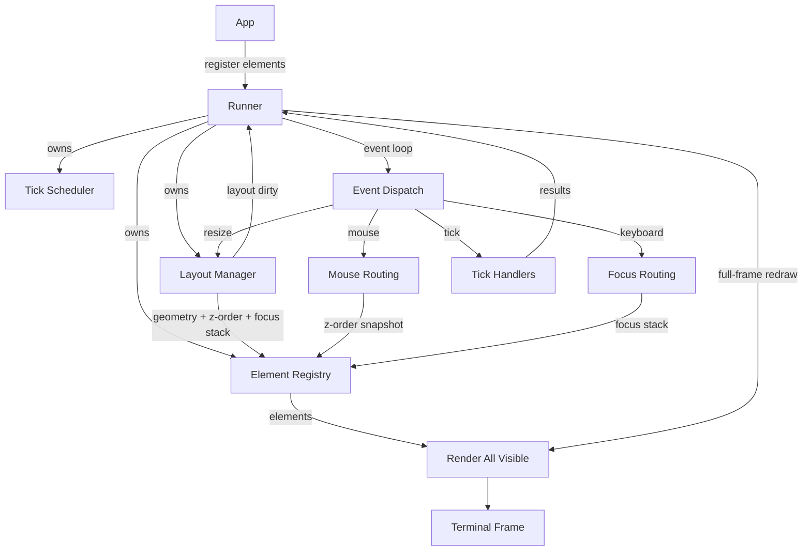

# Layout Manager Architecture

## System Diagram

## Overview
- The app still only registers elements and hands control to the runner.
- The runner owns the event loop, element registry, layout manager, and event dispatch.
- Rendering redraws the full frame each cycle (ratatui requirement). Redraws happen whenever layout is dirty or any element is dirty.
- Each redraw renders all visible elements; dirty flags only control internal element work, not whether render is called.
- The layout manager becomes a first-class system responsible for geometry, focus, and z-order.

## Runtime Phase (Runner) - Event Loop
1. Poll for event (mouse, keyboard, tick, resize)
2. Dispatch event based on type:
   - Mouse: routed by z-order (top-most first), with optional capture
   - Keyboard: routed only to the focused element (top of focus stack)
   - Tick: routed only to scheduled tick handlers (via runner-owned scheduler)
   - Resize: routed only to the layout manager (coalesced)
3. Layout manager recalculates geometry when triggered (resize or focus/layout changes)
4. Determine redraw need: layout dirty OR any element dirty
5. If redraw needed:
   - Full-frame redraw
   - Render all visible elements each redraw (elements can short-circuit internal work if clean)
   - **Runner clears layout dirty flag after successful render (Layout Manager never clears its own flag)**
6. Sleep until next tick

## Layout Manager Design

### Responsibilities
- Own layout computation for all elements
- Assign per-element geometry (Rect) used during render
- Maintain z-order for hit testing and mouse routing
- Maintain z-order as the single ordering source of truth
- Maintain focus stack as a filtered view of focusable elements ordered by z-order
- Maintain focus transitions and fallback focus
- React to resize events and trigger layout recalculation
- Provide read access to geometry and focus for the runner

### Inputs
- Element registrations/deregistrations
- Window size / terminal size
- Element metadata (preferred size, constraints, docking rules, visibility)
- Focus changes (explicit focus requests, mouse clicks, focus cycling)
- Optional layout invalidation signals from elements (for example, content size change)

### Outputs
- Per-element Rects
- Z-order list
- Focus stack (ordered list of element IDs)
- Layout dirty flag for the runner

### Layout Model
- Uses a clear layout strategy (for example, vertical stack, horizontal split, grid, or named regions)
- Each element can declare layout preferences:
  - Min/max size
  - Fixed vs flexible
  - Weight or proportion
  - Alignment and padding
- Layout is recalculated only when needed:
  - Resize event
  - Element add/remove
  - Element requests layout invalidation
  - Focus changes that affect layout (if focus changes appearance/size)
- Layout constraints are solved via cassowary-style constraint resolution with standard strengths

### Focus and Input
- Focus stack is owned by the layout manager
- Rules:
  - Click on element pushes it to top of stack
  - Modal or overlay inserts at top and captures focus
  - Focus cycling (tab) moves through stack or a focusable order list
- The runner consults the focus stack for key event routing
- Fallback focus is tracked: if the focused element unregisters, restore fallback, or focus the first available focusable element

### Z-Order and Hit Testing
- Layout manager provides a z-ordered list of visible elements
- Mouse event routing uses this list to find the top-most element under the cursor
- Optional capture mode:
  - On mouse down, element can capture subsequent mouse events until release
  - Capture overrides hit testing until released
- Capture is released if the element unregisters, times out after 30 seconds, or is force-released on validation failure
- Mouse routing iterates over a snapshot of z-order to avoid mutation during dispatch

### Invalidation and Dirty Coordination
- Layout manager marks itself dirty when layout changes
- Layout changes can trigger element dirty flags (for example, if geometry changed)
- Runner uses layout manager dirty status to decide whether to force a redraw
- Layout invalidation is debounced (16ms) with a pending-invalidation flag to coalesce bursts

**Dirty Flag Lifecycle (One-Way Flow):**
1. **Set**: Layout Manager sets `layout_dirty = true` when layout changes
2. **Read**: Runner reads `layout_dirty` to determine redraw need
3. **Clear**: Runner clears `layout_dirty = false` after successful render

**Rules:**
- Layout Manager NEVER reads its own dirty flag
- Layout Manager NEVER clears its own dirty flag  
- Runner is the sole owner of the dirty flag lifecycle
- This prevents circular dependencies and ensures deterministic state transitions

### Dynamic Registration
- Elements can be added/removed at runtime
- Layout manager updates geometry and z-order accordingly
- Focus stack is updated when focused element is removed (next focusable promoted)
- Element IDs are UUID-based and unique per registration
- Element registry holds weak references with periodic cleanup

### Observability (Optional but Useful)
- Expose layout diagnostics:
  - Current z-order
  - Rects per element
  - Focus stack
  - Last layout recomputation cause

## Key Design Decisions
1. App only registers elements and hands off
2. Runner manages events and rendering
3. Layout manager owns geometry, focus, and z-order
4. Resize handled by layout manager only
5. Full-frame redraw whenever layout is dirty or any element is dirty
6. Render all visible elements each redraw; dirty flags only optimize internal element work
7. Dynamic registration with UUID-based IDs and weak-reference registry
8. Resize and layout invalidation are coalesced to avoid thrash
9. **Dirty flag lifecycle is unidirectional**: Layout Manager sets, Runner reads and clears - prevents circular dependencies

---

## Event Scheduling and Async Handling
- Runner owns a tick scheduler API for registering and clearing tick handlers
- Tick handlers are invoked in the event loop in a deterministic order
- Slow handlers spawn async tasks; results are collected non-blocking before render

## Terminal Safety
- Terminal size is clamped to minimum bounds (width 10, height 5)
- Invalid sizes are logged and ignored for layout computation
